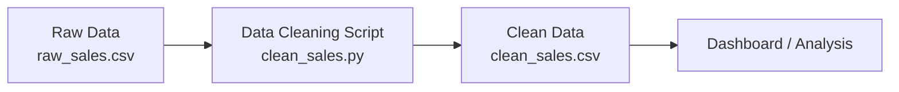

🇳🇬 Nigeria Sales Data Pipeline

---

📌 Project Overview

This project demonstrates a simple end-to-end data engineering pipeline that transforms raw, inconsistent sales data into a clean and structured dataset ready for analysis and reporting.

It simulates a real-world scenario where business data requires cleaning before it can be used for decision-making.

---

🎯 Problem Statement

The raw dataset contains several data quality issues:

- Missing values in key fields
- Invalid data types (e.g., text in numeric columns)
- Incomplete records

These issues make the data unreliable for analytics.

---

💡 Solution Approach

A data pipeline was designed to:

- Ingest raw data
- Clean and validate the dataset
- Handle missing and invalid values
- Output a structured dataset ready for downstream use

---


## 🏗️ Architecture Diagram



---

🔄 Data Pipeline Workflow

🔹 1. Extract

- Source: "raw_sales.csv"
- Format: CSV
- Contains unprocessed and inconsistent sales records

---

🔹 2. Transform

Using Python and Pandas:

- Converted "amount" column to numeric format
- Handled invalid values (e.g., "abc")
- Filled missing values:
  - "amount" → 0
  - "city" → "Unknown"
- Ensured consistency across the dataset

---

🔹 3. Load

- Output: "clean_sales.csv"
- Result: Clean dataset ready for analysis and visualization

---

📂 Project Structure
```text
nigeria-sales-pipeline/

├── raw_sales.csv          # Raw dataset
├── clean_sales.py         # Data cleaning script
├── clean_sales.csv        # Cleaned dataset
├── architecture/
│   └── pipeline.png       # Architecture diagram
└── README.md              # Project documentation
```

---

🛠️ Tools & Technologies

- Python
- Pandas
- CSV (Flat file storage)

---

📊 Data Quality Improvements

- Removed inconsistencies in numeric fields
- Handled missing values effectively
- Standardized dataset structure
- Improved overall data reliability

---

📈 Business Impact

- Enables accurate reporting and analysis
- Improves data quality for decision-making
- Demonstrates real-world data pipeline design

---

🚀 Future Improvements

- Integrate with a database (PostgreSQL/MySQL)
- Automate pipeline execution
- Add dashboard for visualization
- Scale pipeline for larger datasets

---

👤 Author

Samuel

---

📌 Conclusion

This project demonstrates foundational data engineering concepts, including data cleaning, transformation, and pipeline design.

It reflects the process of converting raw data into meaningful and reliable information for business use.
